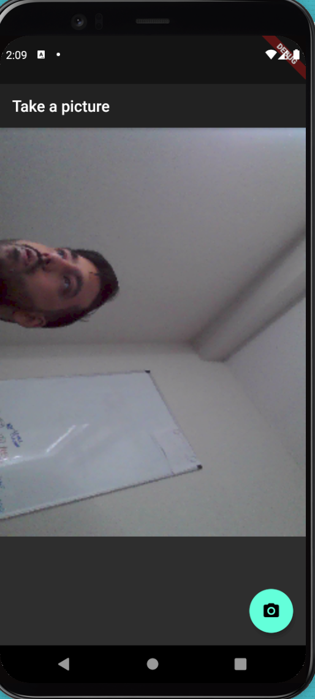
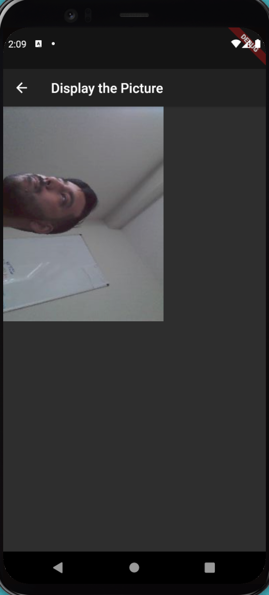

# android_photography

Taking photos on Android

## Getting Started

```bash
$ flutter clean
$ flutter upgrade
$ flutter pub get
$ flutter run
```

<br/>
<br/>

   
   > App in phototaking mode
<br/>
<br/>

<br/>
<br/>

   
   > App displays image captured by camera
<br/>
<br/>